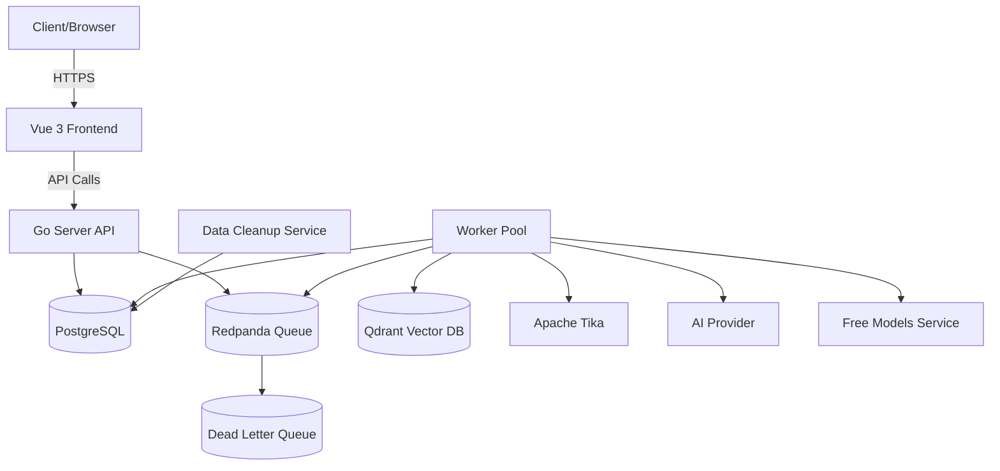
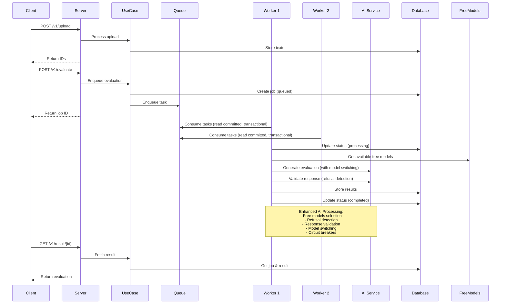
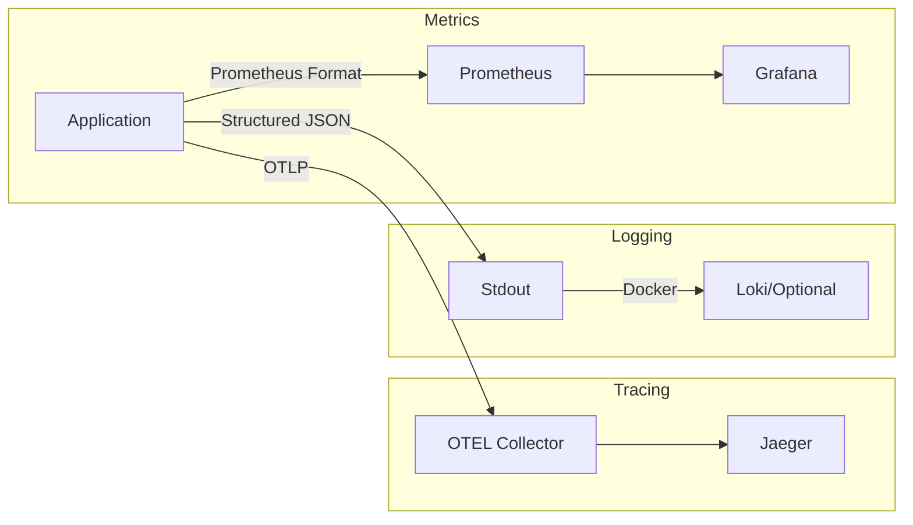

# System Architecture

This service follows Clean Architecture principles with clear separation of concerns and a split server/worker architecture for optimal scalability and reliability.

## System Overview



## Request Flow



## Split Architecture

### Frontend Container (`admin-frontend`)
- **Purpose**: Vue 3 + Vite admin dashboard with Hot Module Replacement
- **Development**: HMR-enabled development server on port 3001
- **Production**: Static files served via Nginx
- **Features**: Modern development workflow with Vue 3, TypeScript, Tailwind CSS

### Server Container (`backend`)
- **Purpose**: API-only HTTP requests and task enqueueing
- **Responsibilities**: 
  - Serve API endpoints
  - Enqueue background tasks to Redpanda
  - Run database migrations
  - Handle authentication and session management
- **Scaling**: Can be scaled horizontally behind load balancer

### Worker Container (`worker`)
- **Purpose**: Process background tasks from Redpanda queue
- **Responsibilities**:
  - Handle AI processing tasks
  - Process file extraction and analysis
  - Update job status and results
- **Scaling**: Runs with 8 replicas for high availability
- **Performance**: 30 concurrent workers per replica (240 total workers)

### Infrastructure Services
- **PostgreSQL**: Primary database for job storage and results
- **Redpanda**: Kafka-compatible queue system for task processing
- **Dead Letter Queue (DLQ)**: Failed job storage and reprocessing
- **Qdrant**: Vector database for AI embeddings and similarity search
- **Apache Tika**: Text extraction from various file formats
- **Nginx**: Reverse proxy and static file serving
- **Observability**: Prometheus, Grafana, Jaeger for monitoring

## Enhanced AI Features

### AI Processing Pipeline
- **Free Models Service**: Cost-effective AI processing using free models
- **Refusal Detection**: AI-powered detection of model refusals
- **Response Validation**: Comprehensive response quality validation
- **Model Switching**: Intelligent model selection with circuit breakers
- **Enhanced Error Handling**: Automatic retry and fallback mechanisms

### Retry and DLQ System
- **Automatic Retry**: Exponential backoff retry for failed jobs
- **Dead Letter Queue**: Storage for permanently failed jobs
- **Error Classification**: Smart retry decisions based on error types
- **Reprocessing**: DLQ jobs can be reprocessed if needed

### Data Lifecycle Management
- **Data Retention**: Configurable data retention policies
- **Automatic Cleanup**: Scheduled cleanup of expired data
- **Compliance**: GDPR and data protection compliance
- **Storage Optimization**: Cost reduction through data lifecycle management

## Production Architecture

### Docker Images
- **Frontend**: `ghcr.io/fairyhunter13/ai-cv-evaluator-frontend:latest`
- **Backend**: `ghcr.io/fairyhunter13/ai-cv-evaluator-server:latest`
- **Worker**: `ghcr.io/fairyhunter13/ai-cv-evaluator-worker:latest`

### Production Configuration
- **Multi-arch builds**: linux/amd64, linux/arm64
- **Security scanning**: Trivy security scans
- **SBOM generation**: Software Bill of Materials for compliance
- **SSL/TLS**: Automatic certificate management with Certbot

### Scaling Strategy
- **Horizontal Scaling**: Worker replicas can be increased independently
- **Vertical Scaling**: CPU and memory limits per container
- **Auto-scaling**: Based on queue metrics and resource utilization
- **Load Balancing**: Server can be scaled behind load balancer

### Performance Optimization
- **Worker Configuration**: 30 workers per replica, 8 replicas total (240 workers)
- **Queue Priorities**: default (10), critical (6), low (1)
- **Retry Logic**: Exponential backoff with timeout handling
- **Resource Allocation**: CPU and memory limits per container
- **Responsibilities**:
  - User interface for testing and consuming APIs
  - File upload forms and result visualization
  - Authentication and session management
  - Real-time job status polling
- **Technology Stack**:
  - **Framework**: Vue 3 with Composition API
  - **Build Tool**: Vite for HMR and fast builds
  - **Styling**: Tailwind CSS for responsive design
  - **State Management**: Pinia for application state
  - **Routing**: Vue Router for SPA navigation
- **Development**: HMR-enabled dev server (port 3001)
- **Production**: Static files served by Nginx
- **Image**: `ghcr.io/fairyhunter13/ai-cv-evaluator-frontend:latest`

### Server Container (`cmd/server`)
- **Purpose**: API-only backend handling HTTP requests and endpoints
- **Responsibilities**:
  - HTTP request handling and routing
  - File upload processing
  - Job creation and status tracking
  - Result retrieval
  - Health checks and metrics
  - Admin authentication API
- **Dependencies**: Database, Redpanda (for job creation)
- **Image**: `ghcr.io/fairyhunter13/ai-cv-evaluator-server:latest`

### Worker Container (`cmd/worker`)
- **Purpose**: Processes background AI evaluation tasks
- **Responsibilities**:
  - Consuming Redpanda queue for tasks
  - AI processing and evaluation
  - Database updates for job status
  - Result storage
- **Configuration**:
  - **Concurrency**: 30 workers per container
  - **Replicas**: 8 containers (240 total concurrent workers)
  - **Queue**: Single topic `evaluate-jobs`, read-committed isolation, transactional offset commits
- **Dependencies**: Database, Redpanda, Qdrant, Tika, AI providers
- **Image**: `ghcr.io/fairyhunter13/ai-cv-evaluator-worker:latest`

### Benefits of Split Architecture
- **Scalability**: Frontend, workers, and server can be scaled independently
- **Reliability**: Server failures don't affect job processing; frontend failures don't affect backend
- **Resource Optimization**: Different resource requirements for each component
- **Deployment Flexibility**: Independent deployment cycles for frontend, backend, and workers
- **Development Experience**: HMR for frontend, independent development workflows
- **Monitoring**: Separate metrics and logging for each component

## Frontend Architecture

### Vue 3 + Vite Application Structure
```
admin-frontend/
├── src/
│   ├── views/           # Page components
│   │   ├── Login.vue
│   │   ├── Dashboard.vue
│   │   ├── Upload.vue
│   │   ├── Evaluate.vue
│   │   └── Result.vue
│   ├── stores/          # Pinia state management
│   │   └── auth.ts
│   ├── App.vue          # Root component
│   └── main.ts          # Application entry point
├── public/              # Static assets
├── package.json         # Dependencies and scripts
├── vite.config.ts      # Vite configuration
├── tailwind.config.js   # Tailwind CSS configuration
└── nginx.conf          # Production Nginx configuration
```

### Frontend Technology Stack
- **Vue 3**: Modern reactive framework with Composition API
- **Vite**: Fast build tool with Hot Module Replacement (HMR)
- **Tailwind CSS**: Utility-first CSS framework for styling
- **Pinia**: State management library for Vue
- **Vue Router**: Client-side routing for SPA navigation
- **TypeScript**: Type safety and better development experience

### Frontend-Backend Communication
- **API Endpoints**: RESTful HTTP API calls to backend
- **Authentication**: Session-based authentication with cookies
- **CORS**: Configured for cross-origin requests during development
- **Error Handling**: Structured error responses with user-friendly messages

## Layers

### Domain (`internal/domain`)
- Pure business entities and interfaces
- No external dependencies
- Error definitions
- Repository and service contracts
  - Entities: `Upload`, `Job`, `Result` with invariants and status machine.
  - Errors: `ErrInvalidArgument`, `ErrNotFound`, `ErrConflict`, `ErrRateLimited`, `ErrUpstreamTimeout`, `ErrUpstreamRateLimit`, `ErrSchemaInvalid`, `ErrInternal`.
  - Ports: `UploadRepository`, `JobRepository`, `ResultRepository`, `Queue`, `AIClient`, `TextExtractor`.
- `internal/usecase/`: application services orchestrating domain + ports:
  - `UploadService`: stores extracted texts.
  - `EvaluateService`: creates a job and enqueues evaluation task.
  - `ResultService`: returns job status and structured result.
- `internal/adapter/`: concrete adapters on the boundary:
  - `httpserver/`: handlers, middleware, error mapping, OpenAPI serve.
  - `repo/postgres/`: Postgres repositories using `pgx`.

## Database Schema

```sql
-- Uploads table stores CV and project texts
CREATE TABLE uploads (
  id TEXT PRIMARY KEY,
  type TEXT NOT NULL CHECK (type IN ('cv','project')),
  text TEXT NOT NULL,
  filename TEXT NOT NULL,
  mime TEXT NOT NULL,
  size BIGINT NOT NULL,
  created_at TIMESTAMPTZ NOT NULL
);

-- Jobs table tracks evaluation requests
CREATE TABLE jobs (
  id TEXT PRIMARY KEY,
  status TEXT NOT NULL CHECK (status IN ('queued','processing','completed','failed')),
  error TEXT NOT NULL DEFAULT '',
  cv_id TEXT NOT NULL REFERENCES uploads(id),
  project_id TEXT NOT NULL REFERENCES uploads(id),
  idempotency_key TEXT,
  created_at TIMESTAMPTZ NOT NULL,
  updated_at TIMESTAMPTZ NOT NULL
);

-- Results table stores evaluation outcomes
CREATE TABLE results (
  job_id TEXT PRIMARY KEY REFERENCES jobs(id),
  cv_match_rate DOUBLE PRECISION NOT NULL,
  cv_feedback TEXT NOT NULL,
  project_score DOUBLE PRECISION NOT NULL,
  project_feedback TEXT NOT NULL,
  overall_summary TEXT NOT NULL,
  created_at TIMESTAMPTZ NOT NULL
);
```

## Key Components

- **HTTP Server**: Chi router with middleware chain
- **Queue Worker**: Redpanda-based transactional processing (exactly-once via Kafka transactions)
- **AI Client**: Abstraction over OpenAI/OpenRouter
- **Vector DB**: Qdrant for RAG storage/retrieval
- **Text Extractor**: Apache Tika for PDF/DOCX.
  - `observability/`: logging, tracing, metrics middleware and job metrics.
  - `vector/qdrant/`: thin Qdrant HTTP client for RAG scaffolding.

## Request Flows

### POST /v1/upload (multipart)
1) HTTP handler validates multipart form and size limits.
2) For `.pdf`/`.docx`, we save a temp file and call `TextExtractor` (Tika). Fallback for `.docx` via stdlib `zip+xml` if extractor not configured.
3) Sanitized text is persisted via `UploadRepository` (Postgres).
4) Returns `{ "cv_id": "...", "project_id": "..." }`.

### POST /v1/evaluate (JSON)
1) Validate DTO fields with `validator/v10` (presence and max lengths). `job_description` and `study_case_brief` are optional - if not provided, default values are used.
2) `EvaluateService.Enqueue` creates a `Job` (status `queued`) and enqueues a task to Redpanda (Kafka-compatible) for immediate worker consumption.
3) Returns `{ "id": "<job-id>", "status": "queued" }` immediately.

### Worker: evaluate_job
1) Update job to `processing` and emit metrics.
2) Load texts for `cv_id` and `project_id` from `uploads`.
3) Evaluate using OpenRouter (chat) and optionally RAG via OpenAI embeddings. If `OPENAI_API_KEY` is not set, RAG is skipped and the prompt uses inline context only.
4) Upsert `results`; update job to `completed` (or `failed`) and record metrics.

### GET /v1/result/{id}
- Returns queued/processing/completed results per `project.md` and ETag for caching when completed.

## Observability Stack



### Metrics
- HTTP request rate, latency, status codes
- AI API call latency and error rates
- Job queue depth and processing times
- Evaluation score distributions

### Tracing
- End-to-end request tracing
- Database query performance
- AI API call spans
- Queue processing traces

### Logging
- Structured JSON with request IDs
- Trace correlation via trace_id
- No PII in logs
- Configurable log levels

## Data Model (ERD)
- uploads(id, type, text, filename, mime, size, created_at)
- jobs(id, status, error, created_at, updated_at, cv_id, project_id, idempotency_key)
- results(job_id, cv_match_rate, cv_feedback, project_score, project_feedback, overall_summary, created_at)

## RAG (Scaffolding)
- Qdrant client provides `EnsureCollection`, `UpsertPoints`, and `Search`.
- Embeddings + provider interfaces populate job description and rubric collections; retrieval merged into prompts.
- When `OPENAI_API_KEY` is absent, embeddings are unavailable and RAG is skipped gracefully.

## Data Flow

1. Client uploads CV and project documents
2. System extracts text and stores in database
3. Client requests evaluation with job description
4. Job queued for async processing
5. Worker retrieves relevant context from Qdrant
6. AI generates structured evaluation
7. Results stored and available via polling

## Deployment

### Development Environment
- **Docker Compose**: Includes server, 8 worker replicas, and all dependencies
- **Worker Configuration**: 30 concurrency per worker, 8 replicas (240 total workers)
- **Services**: PostgreSQL, Redpanda, Qdrant, Tika, and observability stack

### Production Environment
- **Split Images**: Separate server and worker Docker images
- **Server Image**: `ghcr.io/fairyhunter13/ai-cv-evaluator-server:latest`
- **Worker Image**: `ghcr.io/fairyhunter13/ai-cv-evaluator-worker:latest`
- **Worker Replicas**: 8 containers with 30 concurrency each
- **CI/CD**: Automated builds, security scanning, and deployment
- **Multi-arch**: Support for linux/amd64 and linux/arm64

### Container Configuration
```yaml
# Development
worker:
  deploy:
    replicas: 8
  environment:
    - APP_ENV=dev

# Production  
worker:
  deploy:
    replicas: 8
  environment:
    - APP_ENV=prod
```

### Performance Characteristics
- **Throughput**: 240 concurrent workers (8 replicas × 30 concurrency)
- **Queue Processing**: Priority-based with retry logic
- **Job Completion**: 6-10 seconds average processing time
- **Reliability**: Graceful shutdown and error handling
