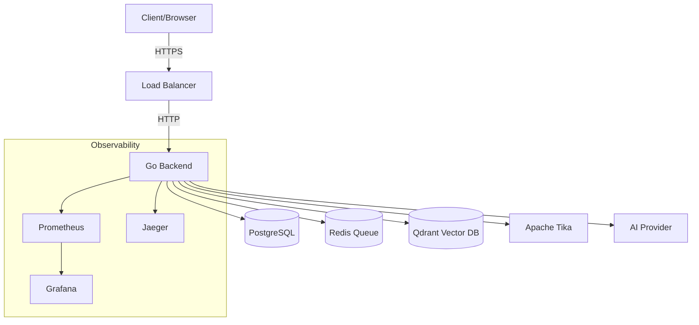
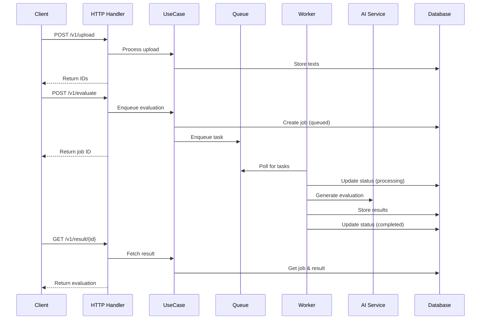
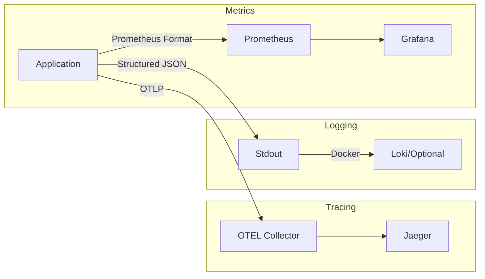

# Architecture

This service follows Clean Architecture principles with clear separation of concerns.

## System Overview



## Request Flow



## Layers

### Domain (`internal/domain`)
- Pure business entities and interfaces
- No external dependencies
- Error definitions
- Repository and service contracts
  - Entities: `Upload`, `Job`, `Result` with invariants and status machine.
  - Errors: `ErrInvalidArgument`, `ErrNotFound`, `ErrConflict`, `ErrRateLimited`, `ErrUpstreamTimeout`, `ErrUpstreamRateLimit`, `ErrSchemaInvalid`, `ErrInternal`.
  - Ports: `UploadRepository`, `JobRepository`, `ResultRepository`, `Queue`, `AIClient`, `TextExtractor`.
- `internal/usecase/`: application services orchestrating domain + ports:
  - `UploadService`: stores extracted texts.
  - `EvaluateService`: creates a job and enqueues evaluation task.
  - `ResultService`: returns job status and structured result.
- `internal/adapter/`: concrete adapters on the boundary:
  - `httpserver/`: handlers, middleware, error mapping, OpenAPI serve.
  - `repo/postgres/`: Postgres repositories using `pgx`.

## Database Schema

```sql
-- Uploads table stores CV and project texts
CREATE TABLE uploads (
  id TEXT PRIMARY KEY,
  type TEXT NOT NULL CHECK (type IN ('cv','project')),
  text TEXT NOT NULL,
  filename TEXT NOT NULL,
  mime TEXT NOT NULL,
  size BIGINT NOT NULL,
  created_at TIMESTAMPTZ NOT NULL
);

-- Jobs table tracks evaluation requests
CREATE TABLE jobs (
  id TEXT PRIMARY KEY,
  status TEXT NOT NULL CHECK (status IN ('queued','processing','completed','failed')),
  error TEXT NOT NULL DEFAULT '',
  cv_id TEXT NOT NULL REFERENCES uploads(id),
  project_id TEXT NOT NULL REFERENCES uploads(id),
  idempotency_key TEXT,
  created_at TIMESTAMPTZ NOT NULL,
  updated_at TIMESTAMPTZ NOT NULL
);

-- Results table stores evaluation outcomes
CREATE TABLE results (
  job_id TEXT PRIMARY KEY REFERENCES jobs(id),
  cv_match_rate DOUBLE PRECISION NOT NULL,
  cv_feedback TEXT NOT NULL,
  project_score DOUBLE PRECISION NOT NULL,
  project_feedback TEXT NOT NULL,
  overall_summary TEXT NOT NULL,
  created_at TIMESTAMPTZ NOT NULL
);
```

## Key Components

- **HTTP Server**: Chi router with middleware chain
- **Queue Worker**: Asynq-based async processing
- **AI Client**: Abstraction over OpenAI/OpenRouter
- **Vector DB**: Qdrant for RAG storage/retrieval
- **Text Extractor**: Apache Tika for PDF/DOCX.
  - `observability/`: logging, tracing, metrics middleware and job metrics.
  - `vector/qdrant/`: thin Qdrant HTTP client for RAG scaffolding.

## Request Flows

### POST /v1/upload (multipart)
1) HTTP handler validates multipart form and size limits.
2) For `.pdf`/`.docx`, we save a temp file and call `TextExtractor` (Tika). Fallback for `.docx` via stdlib `zip+xml` if extractor not configured.
3) Sanitized text is persisted via `UploadRepository` (Postgres).
4) Returns `{ "cv_id": "...", "project_id": "..." }`.

### POST /v1/evaluate (JSON)
1) Validate DTO fields with `validator/v10` (presence and max lengths).
2) `EvaluateService.Enqueue` creates a `Job` (status `queued`) and enqueues a task via Asynq.
3) Returns `{ "id": "<job-id>", "status": "queued" }` immediately.

### Worker: evaluate_job
1) Update job to `processing` and emit metrics.
2) Load texts for `cv_id` and `project_id` from `uploads`.
3) Evaluate using OpenRouter (chat) and optionally RAG via OpenAI embeddings. If `OPENAI_API_KEY` is not set, RAG is skipped and the prompt uses inline context only.
4) Upsert `results`; update job to `completed` (or `failed`) and record metrics.

### GET /v1/result/{id}
- Returns queued/processing/completed results per `project.md` and ETag for caching when completed.

## Observability Stack



### Metrics
- HTTP request rate, latency, status codes
- AI API call latency and error rates
- Job queue depth and processing times
- Evaluation score distributions

### Tracing
- End-to-end request tracing
- Database query performance
- AI API call spans
- Queue processing traces

### Logging
- Structured JSON with request IDs
- Trace correlation via trace_id
- No PII in logs
- Configurable log levels

## Data Model (ERD)
- uploads(id, type, text, filename, mime, size, created_at)
- jobs(id, status, error, created_at, updated_at, cv_id, project_id, idempotency_key)
- results(job_id, cv_match_rate, cv_feedback, project_score, project_feedback, overall_summary, created_at)

## RAG (Scaffolding)
- Qdrant client provides `EnsureCollection`, `UpsertPoints`, and `Search`.
- Embeddings + provider interfaces populate job description and rubric collections; retrieval merged into prompts.
- When `OPENAI_API_KEY` is absent, embeddings are unavailable and RAG is skipped gracefully.

## Data Flow

1. Client uploads CV and project documents
2. System extracts text and stores in database
3. Client requests evaluation with job description
4. Job queued for async processing
5. Worker retrieves relevant context from Qdrant
6. AI generates structured evaluation
7. Results stored and available via polling

## Deployment
- Dockerfile multi-stage build; Compose includes app, Postgres, Redis (Asynq), Qdrant, Tika, and observability stack.
- CI builds, lints, tests, validates OpenAPI, and builds a container image.
- Deploy workflow uses SSH key-based auth and non-blocking compose steps.
