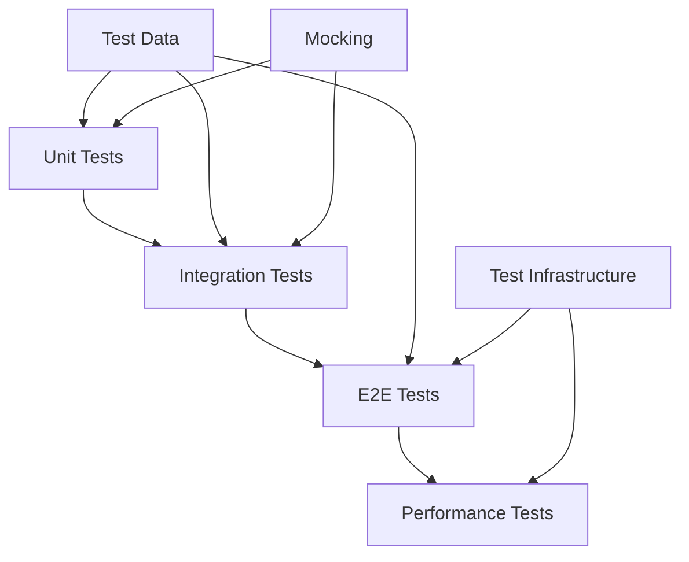

# Testing Strategy

This document outlines the comprehensive testing strategy for the AI CV Evaluator system.

## Overview

The testing strategy follows a pyramid approach with multiple testing levels:
- **Unit Tests** - Fast, isolated component testing
- **Integration Tests** - Component interaction testing  
- **E2E Tests** - Full system testing
- **Performance Tests** - Load and stress testing

## Testing Architecture



## Test Types

### Unit Tests
- **Purpose**: Test individual components in isolation
- **Coverage**: Functions, methods, and small units of code
- **Tools**: Go's built-in testing framework
- **Execution**: `go test -v ./internal/...`

### Integration Tests
- **Purpose**: Test component interactions
- **Coverage**: Database operations, API calls, external services
- **Tools**: Testcontainers for external dependencies
- **Execution**: `go test -tags=integration ./internal/...`

### E2E Tests
- **Purpose**: Test complete user workflows
- **Coverage**: Full system functionality
- **Tools**: Docker Compose, real API calls
- **Execution**: `go test -tags=e2e ./test/e2e/...`

## Test Execution

### Unit Tests
```bash
# Run all unit tests
go test -v -race -timeout=60s -failfast -parallel=4 ./...

# Run with coverage
go test -v -race -timeout=60s -failfast -parallel=4 -cover ./...

# Run specific package
go test -v ./internal/usecase/...
```

### E2E Tests
```bash
# Run E2E tests
go test -tags=e2e -v -race -failfast -count=1 -timeout=90s -parallel=4 ./test/e2e/...

# With specific base URL
E2E_BASE_URL="http://localhost:8080/v1" go test -tags=e2e -v -race -failfast -count=1 -timeout=90s -parallel=4 ./test/e2e/...
```

## Test Data Management

### Test Data Structure
```
test/
├── testdata/           # Test data files
│   ├── cv/            # CV test files
│   ├── project/       # Project test files
│   └── expected/      # Expected results
├── dump/              # E2E test output
└── e2e/              # E2E test files
```

### Test Data Helpers
- **File Upload**: Test CV and project file uploads
- **API Responses**: Mock API responses for testing
- **Database Fixtures**: Test data for database operations

## CI/CD Integration

### GitHub Actions
- **Unit Tests**: Run on every push
- **Integration Tests**: Run on pull requests
- **E2E Tests**: Run on main branch
- **Coverage Reports**: Generated and uploaded

### Test Requirements
- **Build Tags**: E2E tests use `//go:build e2e` tags
- **No Skipping**: All E2E tests must run
- **Response Dumping**: All responses dumped to `test/dump/`
- **Status Validation**: No 'queued' status in final responses

## Debugging

### E2E Debugging
- **Response Dumping**: All responses saved with timestamps
- **Log Analysis**: Comprehensive logging for debugging
- **Health Checks**: Verify system readiness before tests
- **Error Handling**: Clear error messages and stack traces

### Common Issues
- **Service Dependencies**: Ensure all services are running
- **Port Conflicts**: Check for port availability
- **Data Cleanup**: Clear test data between runs
- **Timeout Issues**: Adjust timeouts for slow systems

## Best Practices

### Test Design
- **Isolation**: Tests should not depend on each other
- **Deterministic**: Tests should produce consistent results
- **Fast**: Unit tests should run quickly
- **Clear**: Test names should describe what they test

### Test Maintenance
- **Regular Updates**: Keep tests current with code changes
- **Data Cleanup**: Remove outdated test data
- **Documentation**: Document test scenarios and expected results
- **Performance**: Monitor test execution time