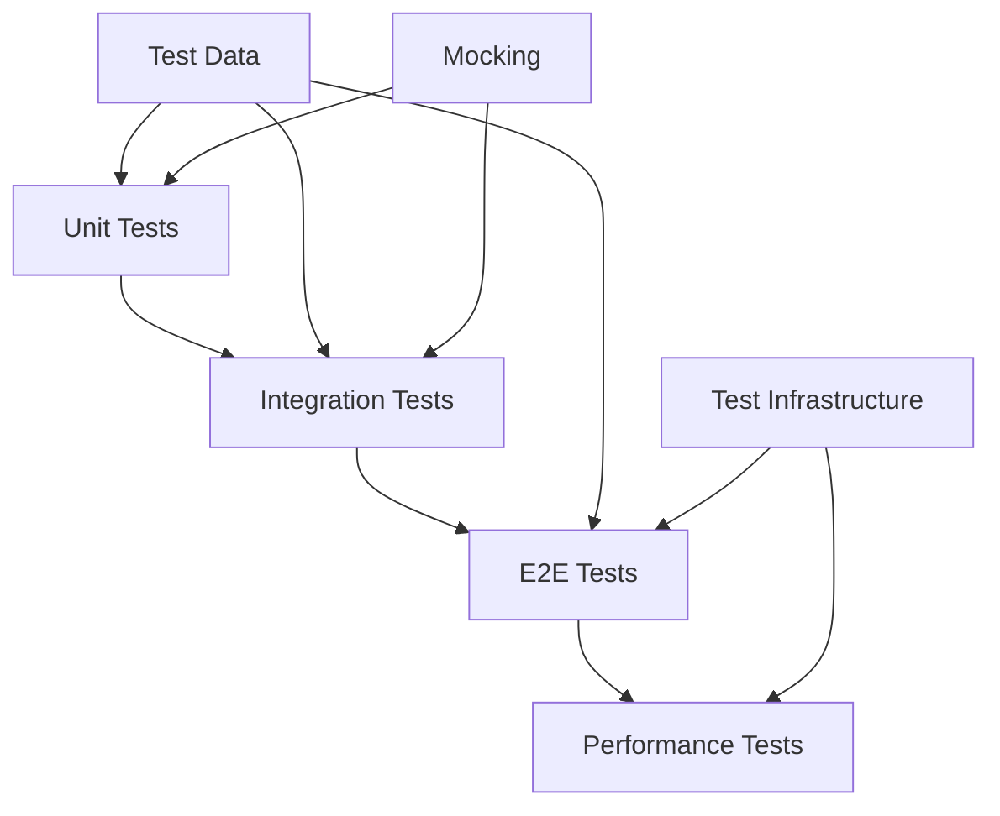

# Testing Strategy and Standards

This document outlines the comprehensive testing strategy and standards for the AI CV Evaluator system, following Go best practices and Clean Architecture principles.

## 🎯 Overview

The testing strategy follows a pyramid approach with multiple testing levels:
- **Unit Tests** - Fast, isolated component testing
- **Integration Tests** - Component interaction testing  
- **E2E Tests** - Full system testing
- **Performance Tests** - Load and stress testing

## 🏗️ Test Placement (Strict)

### Unit Test Placement
- **Unit tests MUST be co-located** next to the code under test
- **Example**: `internal/usecase/service.go` → `internal/usecase/service_test.go`
- **Top-level `test/` tree** reserved for E2E suites (`test/e2e/`) and shared fixtures only
- **No unit tests** under top-level `test/` except `test/e2e/`

### Package Conventions
- **Black-box tests**: `package foo_test` in the same directory to exercise only the public API
- **White-box tests**: `package foo` only when testing unexported helpers is necessary
- **Test data**: Prefer package-local `testdata/` subdirectory for package-specific fixtures

## Testing Architecture



## Test Types

### Unit Tests
- **Purpose**: Test individual components in isolation
- **Coverage**: Functions, methods, and small units of code
- **Tools**: Go's built-in testing framework
- **Execution**: `go test -v ./internal/...`

### Integration Tests
- **Purpose**: Test component interactions
- **Coverage**: Database operations, API calls, external services
- **Tools**: Testcontainers for external dependencies
- **Execution**: `go test -tags=integration ./internal/...`

### E2E Tests
- **Purpose**: Test complete user workflows
- **Coverage**: Full system functionality
- **Tools**: Docker Compose, real API calls
- **Execution**: `go test -tags=e2e ./test/e2e/...`

## 🚀 Test Execution Standards

### Standard Test Command
```bash
go test -v -race -timeout=60s -failfast -parallel=4 ./...
```

### Required Flags
- `-v`: Verbose output (show test names and results)
- `-race`: Enable race condition detection
- `-timeout=60s`: 60-second timeout for all tests
- `-failfast`: Stop on first test failure
- `-parallel=4`: Run up to 4 tests in parallel

### Unit Tests
```bash
# Run all unit tests
go test -v -race -timeout=60s -failfast -parallel=4 ./...

# Run with coverage
go test -v -race -timeout=60s -failfast -parallel=4 -cover ./...

# Run specific package
go test -v -race -timeout=60s -failfast -parallel=4 ./internal/usecase/...

# Without cache
go test -v -race -timeout=60s -failfast -parallel=4 -count=1 ./...
```

### E2E Tests
```bash
# Run E2E tests (with build tags)
go test -tags=e2e -v -race -failfast -count=1 -timeout=90s -parallel=4 ./test/e2e/...

# With specific base URL
E2E_BASE_URL="http://localhost:8080/v1" go test -tags=e2e -v -race -failfast -count=1 -timeout=90s -parallel=4 ./test/e2e/...

# CI E2E execution
make ci-e2e E2E_PARALLEL=4
```

### E2E Test Requirements
- **Build Tags**: ALL E2E test files MUST have `//go:build e2e` and `// +build e2e` build tags
- **No Skipping**: All E2E tests MUST NOT be skipped under any circumstances
- **Status Validation**: Tests must assert that evaluate responses NEVER contain `queued` status
- **Response Dumping**: ALL E2E test scenarios MUST dump responses to `test/dump` directory
- **Parallel Execution**: E2E tests MUST support parallel execution with `t.Parallel()` and `-parallel=4`

## Test Data Management

### Test Data Structure
```
test/
├── testdata/           # Test data files
│   ├── cv/            # CV test files
│   ├── project/       # Project test files
│   └── expected/      # Expected results
├── dump/              # E2E test output
└── e2e/              # E2E test files
```

### Test Data Helpers
- **File Upload**: Test CV and project file uploads
- **API Responses**: Mock API responses for testing
- **Database Fixtures**: Test data for database operations

## 📊 Test Quality Standards

### Coverage Requirements
- **New Code**: Minimum 80% line coverage
- **Critical Paths**: 100% coverage for business logic
- **Error Handling**: Test all error conditions
- **Integration**: Test all external dependencies

### Test Structure Best Practices
- **Unit Tests**: Test individual functions and methods
- **Integration Tests**: Test component interactions
- **Mocking**: Use mocks for external dependencies
- **Fixtures**: Use consistent test data
- **Naming**: Use descriptive test names (TestFunction_Scenario_ExpectedResult)

### Test Maintenance Rules
- **Update Immediately**: Update tests with every code change
- **Remove Broken Tests**: Delete tests that reference undefined/removed functions
- **Refactor Tests**: Refactor tests when code is refactored
- **Keep Current**: Maintain up-to-date test documentation
- **Monitor Performance**: Optimize test execution time

## ✅ Quality Gates

### Mandatory Checks
- **All Tests Pass**: No broken tests after code changes
- **No Undefined References**: Remove tests calling undefined/removed functions
- **Adequate Coverage**: Maintain minimum coverage requirements
- **Performance**: Tests complete within timeout limits
- **Reliability**: Tests are deterministic and repeatable

### Validation Commands
```bash
# Validate all tests pass
go test -v -race -timeout=60s -failfast -parallel=4 ./...

# Check test coverage
go test -v -race -timeout=60s -failfast -parallel=4 -cover ./...

# Run performance tests
go test -v -race -timeout=60s -failfast -parallel=4 -bench=. ./...
```

## 🔄 CI/CD Integration

### GitHub Actions
- **Unit Tests**: Run on every push with race detection
- **Integration Tests**: Run on pull requests
- **E2E Tests**: Run on main branch with live providers
- **Coverage Reports**: Generated and uploaded as artifacts
- **Test Placement**: Enforce unit test placement rules

### Test Requirements
- **Build Tags**: E2E tests use `//go:build e2e` tags
- **No Skipping**: All E2E tests must run
- **Response Dumping**: All responses dumped to `test/dump/`
- **Status Validation**: No 'queued' status in final responses

## Debugging

### E2E Debugging
- **Response Dumping**: All responses saved with timestamps
- **Log Analysis**: Comprehensive logging for debugging
- **Health Checks**: Verify system readiness before tests
- **Error Handling**: Clear error messages and stack traces

### Common Issues
- **Service Dependencies**: Ensure all services are running
- **Port Conflicts**: Check for port availability
- **Data Cleanup**: Clear test data between runs
- **Timeout Issues**: Adjust timeouts for slow systems

## Best Practices

### Test Design
- **Isolation**: Tests should not depend on each other
- **Deterministic**: Tests should produce consistent results
- **Fast**: Unit tests should run quickly
- **Clear**: Test names should describe what they test

### Test Maintenance
- **Regular Updates**: Keep tests current with code changes
- **Data Cleanup**: Remove outdated test data
- **Documentation**: Document test scenarios and expected results
- **Performance**: Monitor test execution time