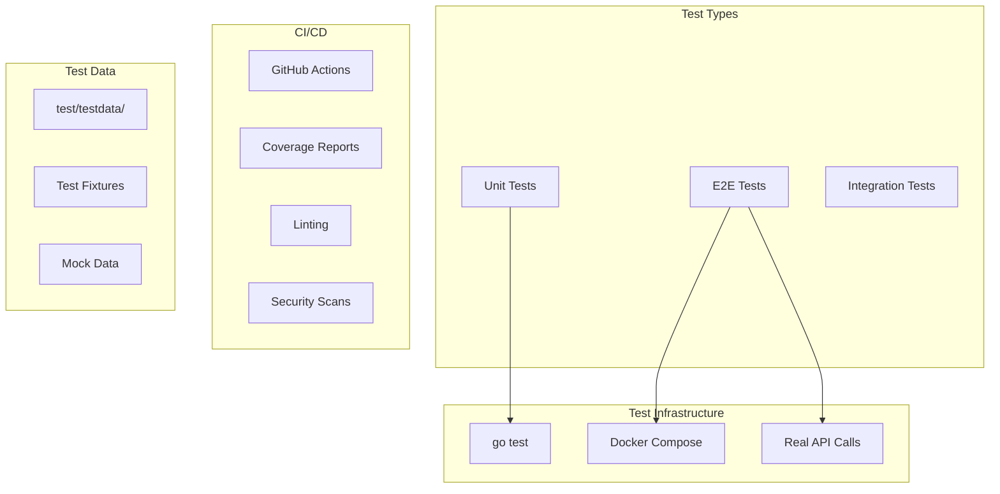

# Testing Infrastructure

This document describes the comprehensive testing infrastructure for the AI CV Evaluator project, including unit tests, E2E tests, and CI/CD integration.

## Overview

The project implements a multi-layered testing strategy:

- **Unit Tests**: Fast, isolated tests for individual components
- **E2E Tests**: Full-stack integration tests with real services
- **Coverage Reporting**: Comprehensive test coverage tracking
- **CI/CD Integration**: Automated testing in GitHub Actions

## Testing Architecture



## Unit Testing

### Test Structure

```
internal/
├── adapter/
│   ├── httpserver/
│   │   ├── handlers_test.go
│   │   ├── responses_test.go
│   │   └── middleware_test.go
│   ├── repo/
│   │   └── postgres/
│   │       ├── uploads_repo_test.go
│   │       ├── jobs_repo_test.go
│   │       └── results_repo_test.go
│   └── queue/
│       └── redpanda/
│           ├── producer_test.go
│           └── consumer_test.go
├── usecase/
│   ├── upload_test.go
│   ├── evaluate_test.go
│   └── result_test.go
└── config/
    └── config_test.go
```

### Running Unit Tests

```bash
# Run all unit tests
make test

# Run tests with coverage
go test -v -race -timeout=60s -failfast -parallel=4 -cover ./...

# Run tests for specific package
go test -v -race -timeout=60s -failfast -parallel=4 ./internal/adapter/httpserver

# Run tests with coverage report
make cover
```

### Test Configuration

**Required Flags:**
- `-v`: Verbose output
- `-race`: Race condition detection
- `-timeout=60s`: 60-second timeout
- `-failfast`: Stop on first failure
- `-parallel=4`: Run up to 4 tests in parallel

### Coverage Requirements

- **Minimum Coverage**: 80% overall
- **Package Coverage**: Tracked per package
- **Coverage Reports**: Generated in `coverage/` directory

```bash
# Generate coverage report
go test -v -race -timeout=60s -failfast -parallel=4 -coverprofile=coverage/coverage.out ./...

# View coverage in HTML
go tool cover -html=coverage/coverage.out -o coverage/coverage.html
```

## E2E Testing

### Test Structure

```
test/
├── e2e/
│   ├── happy_path_e2e_test.go
│   ├── smoke_random_e2e_test.go
│   ├── rfc_real_responses_e2e_test.go
│   ├── helpers_e2e_test.go
│   └── helpers_smoke_e2e_test.go
└── testdata/
    ├── cv_01.txt
    ├── cv_02.txt
    ├── project_01.txt
    ├── project_02.txt
    ├── cv_optimized_2025.md
    └── project_repo_report.txt
```

### E2E Test Categories

#### 1. Happy Path Tests (`happy_path_e2e_test.go`)

**Purpose**: Test the complete workflow from upload to result.

**Test Flow**:
1. Upload CV and project files
2. Enqueue evaluation job
3. Wait for completion
4. Verify result structure

**Key Features**:
- Tests complete evaluation pipeline
- Validates job status transitions
- Verifies result structure
- Tests ETag caching

#### 2. Smoke Tests (`smoke_random_e2e_test.go`)

**Purpose**: Random testing with diverse test data.

**Test Flow**:
1. Select random CV/project pair from test data
2. Execute complete workflow
3. Verify successful completion

**Key Features**:
- Uses diverse test data
- Tests with different content types
- Validates system stability

#### 3. RFC Evidence Tests (`rfc_real_responses_e2e_test.go`)

**Purpose**: Generate real responses for RFC documentation.

**Test Flow**:
1. Use real CV and project report
2. Execute evaluation
3. Capture JSON responses
4. Generate evidence for RFC

**Key Features**:
- Uses real candidate data
- Captures actual API responses
- Generates documentation evidence

### Running E2E Tests

```bash
# Run E2E tests (fast mode)
make test-e2e

# Run E2E tests with full stack
make ci-e2e

# Run E2E tests with custom base URL
E2E_BASE_URL=http://localhost:8080/v1 make test-e2e

# Run E2E tests with logging
E2E_LOG_DIR=artifacts/e2e-logs make ci-e2e
```

### E2E Test Configuration

**Environment Variables**:
- `E2E_BASE_URL`: Base URL for API calls
- `E2E_TIMEOUT`: Test timeout (default: 5m)
- `E2E_LOG_DIR`: Directory for test logs
- `E2E_CLEAR_DUMP`: Clear dump directory (default: true)
- `E2E_START_SERVICES`: Start services automatically (default: false)

**Test Data**:
- **CV Files**: 10 different CV samples
- **Project Files**: 10 different project samples
- **Real Data**: Actual candidate CV and project report
- **Edge Cases**: Empty files, malformed content

## Test Data Management

### Test Data Structure

```
test/testdata/
├── cv_01.txt          # Sample CV 1
├── cv_02.txt          # Sample CV 2
├── ...
├── cv_10.txt          # Sample CV 10
├── project_01.txt     # Sample Project 1
├── project_02.txt     # Sample Project 2
├── ...
├── project_10.txt     # Sample Project 10
├── cv_optimized_2025.md    # Real candidate CV
└── project_repo_report.txt  # Real project report
```

### Test Data Features

- **Diverse Content**: Different CV styles and project types
- **Real Data**: Actual candidate materials
- **Edge Cases**: Empty files, malformed content
- **Format Variety**: Text, Markdown, structured content

### Adding Test Data

```bash
# Add new CV sample
echo "New CV content" > test/testdata/cv_11.txt

# Add new project sample
echo "New project content" > test/testdata/project_11.txt

# Update test data index
go run test/e2e/helpers_e2e_test.go
```

## CI/CD Integration

### GitHub Actions Workflow

```yaml
name: CI/CD Pipeline

on:
  push:
    branches: [main, develop]
  pull_request:
    branches: [main]

jobs:
  test:
    runs-on: ubuntu-latest
    steps:
      - uses: actions/checkout@v4
      - name: Setup Go
        uses: actions/setup-go@v4
        with:
          go-version: '1.24'
      
      - name: Run Unit Tests
        run: make ci-test
      
      - name: Run E2E Tests
        run: make ci-e2e
      
      - name: Upload Coverage
        uses: codecov/codecov-action@v3
```

### Quality Gates

**Required Checks**:
- ✅ All unit tests pass
- ✅ E2E tests pass
- ✅ Coverage ≥ 80%
- ✅ Linting passes
- ✅ Security scans pass
- ✅ OpenAPI validation passes

### Coverage Reporting

**Coverage Reports**:
- **HTML Report**: `coverage/coverage.html`
- **Function Report**: `coverage/coverage.func.txt`
- **Package Reports**: Individual package coverage
- **Overall Coverage**: Combined coverage report

## Testing Best Practices

### 1. Unit Test Guidelines

**Test Structure**:
```go
func TestFunctionName_Scenario_ExpectedResult(t *testing.T) {
    // Arrange
    setup := createTestSetup()
    
    // Act
    result, err := functionUnderTest(setup)
    
    // Assert
    assert.NoError(t, err)
    assert.Equal(t, expected, result)
}
```

**Best Practices**:
- Use table-driven tests for multiple scenarios
- Mock external dependencies
- Test both success and failure cases
- Use descriptive test names
- Keep tests independent

### 2. E2E Test Guidelines

**Test Structure**:
```go
func TestE2E_FeatureName_ExpectedBehavior(t *testing.T) {
    if testing.Short() {
        t.Skip("Skipping E2E tests in short mode")
    }
    
    // Setup
    client := createHTTPClient()
    
    // Execute workflow
    result := executeWorkflow(t, client)
    
    // Verify results
    assertWorkflowSuccess(t, result)
}
```

**Best Practices**:
- Skip tests in short mode
- Use real HTTP client
- Test complete workflows
- Verify all response fields
- Clean up test data

### 3. Test Data Guidelines

**Data Organization**:
- Use descriptive filenames
- Include diverse content types
- Add real-world examples
- Include edge cases
- Document data sources

**Data Quality**:
- Ensure realistic content
- Include various formats
- Test different scenarios
- Maintain data privacy
- Update regularly

## Debugging Tests

### Unit Test Debugging

```bash
# Run specific test with verbose output
go test -v -run TestSpecificFunction ./internal/adapter/httpserver

# Run test with race detection
go test -race -run TestSpecificFunction ./internal/adapter/httpserver

# Run test with coverage
go test -cover -run TestSpecificFunction ./internal/adapter/httpserver
```

### E2E Test Debugging

```bash
# Run E2E test with logging
E2E_LOG_DIR=debug-logs make ci-e2e

# Check test logs
tail -f debug-logs/compose.follow.log

# Check for errors
grep -i error debug-logs/compose.errors.log
```

### Common Issues

**1. Test Timeouts**:
```bash
# Increase timeout
go test -timeout=120s ./test/e2e
```

**2. Service Dependencies**:
```bash
# Start services manually
docker compose up -d
make test-e2e E2E_START_SERVICES=false
```

**3. Coverage Issues**:
```bash
# Check coverage per package
go test -cover ./internal/adapter/httpserver
go test -cover ./internal/usecase
```

## Performance Testing

### Load Testing

```bash
# Run load tests
go test -run TestLoad ./test/e2e

# Monitor performance
docker stats
```

### Benchmark Testing

```bash
# Run benchmarks
go test -bench=. ./internal/adapter/httpserver

# Run specific benchmark
go test -bench=BenchmarkHandler ./internal/adapter/httpserver
```

## Test Maintenance

### Regular Tasks

1. **Update Test Data**: Add new test cases regularly
2. **Review Coverage**: Ensure coverage stays above 80%
3. **Update Dependencies**: Keep test dependencies current
4. **Review Test Performance**: Optimize slow tests
5. **Clean Up**: Remove obsolete tests

### Monitoring

- **Test Execution Time**: Track test performance
- **Coverage Trends**: Monitor coverage changes
- **Failure Rates**: Track test reliability
- **CI/CD Performance**: Monitor pipeline speed

## Troubleshooting

### Common Issues

**1. Tests Failing Intermittently**:
- Check for race conditions
- Verify test isolation
- Review timing dependencies

**2. E2E Tests Timing Out**:
- Check service health
- Verify network connectivity
- Review test timeouts

**3. Coverage Below Threshold**:
- Add missing test cases
- Review uncovered code
- Improve test quality

### Getting Help

- **Check Logs**: Review test output
- **Run Locally**: Reproduce issues locally
- **Check Dependencies**: Verify service availability
- **Review Documentation**: Check this guide

## Future Enhancements

### Planned Improvements

1. **Performance Testing**: Add load testing
2. **Visual Testing**: Add UI testing
3. **Security Testing**: Add security test cases
4. **Integration Testing**: Add more integration tests
5. **Test Automation**: Improve test automation

### Testing Tools

- **Test Containers**: For integration testing
- **Mock Services**: For external dependencies
- **Performance Tools**: For load testing
- **Security Scanners**: For security testing

---

*This testing infrastructure ensures comprehensive coverage and reliable operation of the AI CV Evaluator system.*
