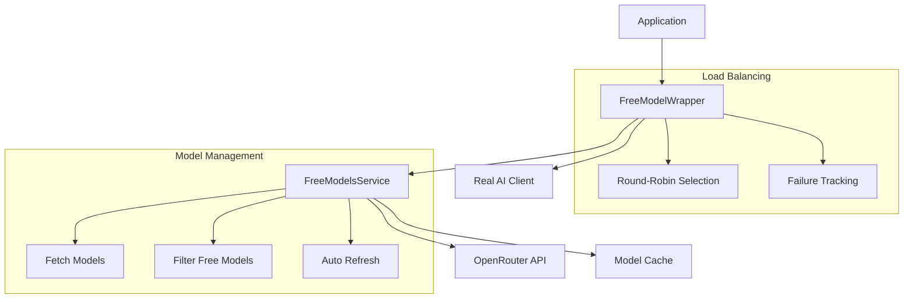

# Free Models Implementation

This document describes the comprehensive free models implementation that automatically manages and rotates through free OpenRouter models for cost-effective AI operations.

## Overview

The free models system provides:
- **Automatic Model Discovery**: Fetches available free models from OpenRouter API
- **Intelligent Load Balancing**: Round-robin distribution across available models
- **Failure Handling**: Automatic model blacklisting and recovery
- **Cost Optimization**: Uses only free models to minimize operational costs
- **High Availability**: Automatic fallback when models become unavailable

## Architecture



## Components

### 1. FreeModelsService (`internal/adapter/ai/freemodels/service.go`)

**Purpose**: Manages free model discovery and caching.

**Key Features**:
- Fetches models from OpenRouter API
- Filters for free models (zero pricing)
- Caches models with configurable refresh interval
- Thread-safe model access

**Configuration**:
```go
type Service struct {
    httpClient    *http.Client
    models        []Model
    modelsMutex   sync.RWMutex
    lastFetch     time.Time
    fetchInterval time.Duration
    apiKey        string
    baseURL       string
}
```

**Methods**:
- `GetFreeModels(ctx)` - Returns all available free models
- `GetRandomFreeModel(ctx)` - Returns a random free model
- `GetBestFreeModel(ctx)` - Returns the best free model by context length

### 2. FreeModelWrapper (`internal/adapter/ai/freemodels/wrapper.go`)

**Purpose**: Wraps the real AI client to use free models automatically.

**Key Features**:
- Round-robin load balancing across free models
- Model failure tracking and blacklisting
- Automatic model selection
- Fallback handling

**Configuration**:
```go
type FreeModelWrapper struct {
    client        domain.AIClient
    freeModelsSvc *Service
    cfg           config.Config
    lastModel     string
    modelFailures map[string]int
    maxFailures   int
    roundRobinIdx int
    mu            sync.Mutex
}
```

## Implementation Details

### Model Discovery

The service automatically discovers free models by:

1. **API Call**: Fetches all models from OpenRouter API
2. **Filtering**: Identifies models with zero pricing
3. **Caching**: Stores results with configurable TTL
4. **Refresh**: Automatically refreshes when cache expires

```go
func (s *Service) GetFreeModels(ctx context.Context) ([]Model, error) {
    s.modelsMutex.RLock()
    needsRefresh := s.lastFetch.IsZero() || time.Since(s.lastFetch) > s.fetchInterval
    s.modelsMutex.RUnlock()

    if needsRefresh {
        if err := s.fetchModels(ctx); err != nil {
            slog.Warn("failed to fetch fresh models, using cached", slog.Any("error", err))
        }
    }
    // Return cached models
}
```

### Load Balancing

The wrapper implements intelligent load balancing:

1. **Rate-Limit-Aware Round-Robin**: Distributes requests across models that are not currently rate-limited; when all are blocked, selects the one with the shortest remaining wait
2. **Failure Tracking**: Tracks failures per model
3. **Rate Limit Cache**: Parses `Retry-After` header on 429 to set per-model cooldowns and skips them until unblocked
4. **Recovery**: Automatically reintroduces models when cooldown expires; resets when all models fail

```go
// Selection is performed inside the real client using RateLimitCache signals:
// 1) Build buckets: unblocked models, blocked models sorted by RemainingBlockDuration
// 2) Round-robin within the unblocked bucket; add fallbacks from the remainder
// 3) If all blocked, choose the shortest-wait model first
```

### Failure Handling

The system implements robust failure handling:

1. **Failure Tracking**: Counts failures per model
2. **Blacklisting**: Removes models after max failures
3. **Recovery**: Resets blacklist when all models fail
4. **Logging**: Comprehensive logging for debugging

```go
// Track model failures
if err != nil {
    w.mu.Lock()
    w.modelFailures[modelID]++
    w.mu.Unlock()
    
    slog.Warn("model failed, incrementing failure count",
        slog.String("model", modelID),
        slog.Int("failures", w.modelFailures[modelID]))
}
```

## Configuration

### Environment Variables

```bash
# OpenRouter Configuration
OPENROUTER_API_KEY=your_api_key
OPENROUTER_BASE_URL=https://openrouter.ai/api/v1

# Free Models Configuration
FREE_MODELS_REFRESH=1h  # How often to refresh model list
CHAT_MODEL=             # Leave empty to use free models
CHAT_FALLBACK_MODELS=   # Fallback models if free models fail
```

### Configuration Options

```go
type Config struct {
    OpenRouterAPIKey     string        `env:"OPENROUTER_API_KEY"`
    OpenRouterBaseURL    string        `env:"OPENROUTER_BASE_URL"`
    FreeModelsRefresh    time.Duration `env:"FREE_MODELS_REFRESH" envDefault:"1h"`
    ChatModel            string        `env:"CHAT_MODEL" envDefault:""`
    ChatFallbackModels   []string      `env:"CHAT_FALLBACK_MODELS"`
}
```

## Usage Examples

### Basic Usage

```go
// Create wrapper with configuration
wrapper := freemodels.NewFreeModelWrapper(cfg)

// Use in AI operations
result, err := wrapper.ChatJSON(ctx, messages, responseType)
if err != nil {
    // Handle error
}
```

### Custom Configuration

```go
// Create service with custom refresh interval
service := freemodels.NewWithRefresh(apiKey, baseURL, 30*time.Minute)

// Get available free models
models, err := service.GetFreeModels(ctx)
if err != nil {
    return err
}

// Get best free model
bestModel, err := service.GetBestFreeModel(ctx)
if err != nil {
    return err
}
```

## Monitoring and Observability

### Metrics

The system provides comprehensive logging:

```go
slog.Info("fetched free models from OpenRouter",
    slog.Int("total_models", len(response.Data)),
    slog.Int("free_models", len(freeModels)))

slog.Debug("selected model using round-robin",
    slog.String("model", selectedModel),
    slog.Int("index", w.roundRobinIdx-1),
    slog.Int("total_available", len(availableModels)))
```

### Health Checks

Monitor free model availability:

```go
// Check if free models are available
models, err := wrapper.GetFreeModelsInfo(ctx)
if err != nil {
    // Handle error
}

if len(models) == 0 {
    // No free models available
    return fmt.Errorf("no free models available")
}
```

## Performance Characteristics

### Throughput
- **Model Discovery**: ~2-3 seconds per refresh
- **Model Selection**: <1ms per request
- **Failure Detection**: Immediate
- **Recovery**: Automatic within 1 hour

### Resource Usage
- **Memory**: ~1MB for model cache
- **CPU**: Minimal overhead
- **Network**: API calls only during refresh
- **Storage**: No persistent storage required

## Troubleshooting

### Common Issues

1. **No Free Models Available**
   ```bash
   # Check OpenRouter API key
   curl -H "Authorization: Bearer $OPENROUTER_API_KEY" \
        https://openrouter.ai/api/v1/models
   ```

2. **All Models Blacklisted**
   ```bash
   # Check logs for failure patterns
   grep "model failed" logs/app.log
   ```

3. **Slow Model Selection**
   ```bash
   # Check if models are being refreshed
   grep "fetched free models" logs/app.log
   ```

### Debug Mode

Enable debug logging:

```go
// Set log level to debug
slog.SetLogLevel(slog.LevelDebug)

// Check model selection
slog.Debug("selecting free model", 
    slog.String("available_models", strings.Join(availableModels, ",")))
```

## Best Practices

### 1. Model Selection Strategy
- Use round-robin for even distribution
- Implement failure tracking for reliability
- Provide fallback mechanisms

### 2. Error Handling
- Always check for model availability
- Implement graceful degradation
- Log failures for monitoring

### 3. Performance Optimization
- Cache model lists to reduce API calls
- Use appropriate refresh intervals
- Monitor model performance

### 4. Monitoring
- Track model success rates
- Monitor API response times
- Alert on model unavailability

## Future Enhancements

### Planned Features
1. **Model Performance Tracking**: Track response times per model
2. **Intelligent Selection**: Choose models based on performance
3. **Health Monitoring**: Proactive model health checks
4. **Cost Tracking**: Monitor actual costs vs. expected

### Integration Opportunities
1. **Prometheus Metrics**: Export model usage metrics
2. **Grafana Dashboards**: Visualize model performance
3. **Alerting**: Notify on model failures
4. **Analytics**: Track model usage patterns

## References

- [OpenRouter API Documentation](https://openrouter.ai/docs)
- [Free Models List](https://openrouter.ai/models)
- [franz-go Client Library](https://github.com/twmb/franz-go)
- [Go Context Package](https://pkg.go.dev/context)

---

*This implementation provides a robust, cost-effective solution for AI operations using free models while maintaining high availability and performance.*
