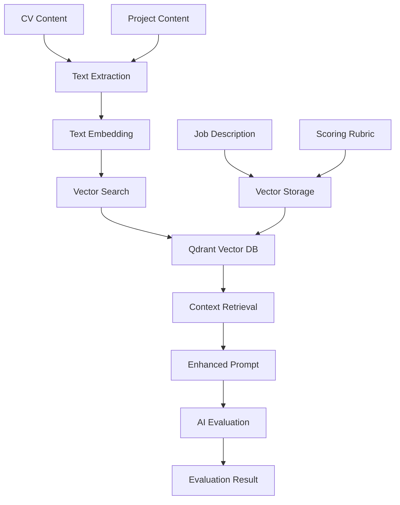

# RAG & Qdrant Implementation

This document describes the Retrieval-Augmented Generation (RAG) implementation using Qdrant vector database in the AI CV Evaluator system.

## Overview

The system uses RAG to enhance AI evaluation by retrieving relevant context from vectorized knowledge bases before generating responses. This improves evaluation accuracy and consistency.

## Architecture



## Qdrant Vector Database

### Configuration
```yaml
QDRANT_URL: "http://localhost:6333"
QDRANT_API_KEY: "your-api-key"  # Optional
```

### Collections
The system uses two main collections:

#### 1. Job Description Collection
- **Purpose**: Store job description embeddings
- **Schema**: Vector + metadata
- **Usage**: Retrieve relevant job requirements

#### 2. Scoring Rubric Collection  
- **Purpose**: Store scoring rubric embeddings
- **Schema**: Vector + metadata
- **Usage**: Retrieve evaluation criteria

### Vector Dimensions
- **Embedding Model**: `text-embedding-3-small`
- **Dimensions**: 1536 (OpenAI standard)
- **Distance Metric**: Cosine similarity

## RAG Implementation

### Core Components

#### 1. Vector Client (`internal/adapter/vector/qdrant/`)
```go
type Client struct {
    client *qdrant.Client
    config Config
}

// Search for similar vectors
func (c *Client) SearchCollection(
    collection string,
    vector []float32,
    limit int,
    scoreThreshold float32,
) ([]SearchResult, error)
```

#### 2. RAG Context Retrieval (`internal/adapter/queue/shared/`)
```go
func retrieveRAGContext(
    ctx context.Context,
    ai domain.AIClient,
    q *qdrantcli.Client,
    cvContent, projectContent string,
) (string, error)
```

### RAG Process Flow

#### Step 1: Content Embedding
```go
// Generate embeddings for CV and project content
cvEmbedding, err := ai.Embed(ctx, []string{cvContent})
projectEmbedding, err := ai.Embed(ctx, []string{projectContent})
```

#### Step 2: Vector Search
```go
// Search job description collection
jobResults, err := q.SearchCollectionAdvanced(
    "job_description",
    cvEmbedding[0],
    5, // top 5 results
    0.7, // similarity threshold
)

// Search scoring rubric collection  
rubricResults, err := q.SearchCollectionAdvanced(
    "scoring_rubric", 
    projectEmbedding[0],
    5,
    0.7,
)
```

#### Step 3: Context Assembly
```go
// Combine retrieved contexts
context := fmt.Sprintf(`
Job Requirements Context:
%s

Evaluation Criteria Context:
%s
`, jobContext, rubricContext)
```

#### Step 4: Enhanced Prompt Generation
```go
// Create enhanced prompt with RAG context
enhancedPrompt := fmt.Sprintf(`
%s

Additional Context:
%s
`, basePrompt, ragContext)
```

## RAG Integration Points

### 1. Enhanced Evaluation Handler
Located in `internal/adapter/queue/shared/handler.go`

```go
func PerformEnhancedEvaluation(
    ctx context.Context,
    ai domain.AIClient,
    q *qdrantcli.Client,
    cvContent, projectContent, jobDesc, studyCase, scoringRubric string,
    jobID string,
) (domain.Result, error) {
    
    // RAG context retrieval (with fallback)
    if q != nil {
        context, err := retrieveRAGContext(ctx, ai, q, cvContent, projectContent)
        if err != nil {
            slog.Warn("RAG context retrieval failed, using base prompt", slog.Any("error", err))
        } else {
            ragContext = context
        }
    }
    
    // Continue with enhanced evaluation...
}
```

### 2. Graceful Fallback
The system implements graceful fallback when RAG is unavailable:

```go
if q != nil {
    // Attempt RAG retrieval
    context, err := retrieveRAGContext(ctx, ai, q, cvContent, projectContent)
    if err != nil {
        // Log warning but continue without RAG
        slog.Warn("RAG context retrieval failed, using base prompt", slog.Any("error", err))
    } else {
        ragContext = context
    }
}
// Continue with base prompt if RAG fails
```

## Vector Search Strategies

### 1. Advanced Search
```go
func (c *Client) SearchCollectionAdvanced(
    collection string,
    vector []float32,
    limit int,
    scoreThreshold float32,
) ([]SearchResult, error)
```

**Features:**
- Configurable similarity threshold
- Limit result count
- Score-based filtering
- Metadata retrieval

### 2. Multi-Collection Search
```go
// Search both collections simultaneously
jobResults, _ := q.SearchCollection("job_description", cvEmbedding, 5, 0.7)
rubricResults, _ := q.SearchCollection("scoring_rubric", projectEmbedding, 5, 0.7)
```

### 3. Hybrid Search
```go
// Combine semantic and keyword search
semanticResults := q.SearchCollection("job_description", embedding, 3, 0.8)
keywordResults := q.SearchByKeywords("job_description", keywords, 2)
```

## RAG Effectiveness Monitoring

### Metrics Collection
```go
// Record RAG effectiveness
RecordRAGEffectiveness(collection, queryType, effectiveness)

// Record RAG errors
RecordRAGRetrievalError(collection, errorType)
```

### Effectiveness Calculation
```go
effectiveness := float64(len(relevantResults)) / float64(totalResults)
```

### Monitoring Metrics
- **RAG Effectiveness**: Retrieval success rate
- **Context Quality**: Relevance of retrieved context
- **Retrieval Latency**: Time to retrieve context
- **Error Rates**: RAG retrieval failures

## Configuration

### Environment Variables
```bash
# Qdrant Configuration
QDRANT_URL=http://localhost:6333
QDRANT_API_KEY=your-api-key

# Embedding Configuration  
EMBEDDINGS_MODEL=text-embedding-3-small
EMBED_CACHE_SIZE=2048

# RAG Configuration
RAG_ENABLED=true
RAG_SIMILARITY_THRESHOLD=0.7
RAG_MAX_RESULTS=5
```

### Qdrant Collections Setup
```python
# Example collection creation
from qdrant_client import QdrantClient
from qdrant_client.http import models

client = QdrantClient("localhost", port=6333)

# Create job description collection
client.create_collection(
    collection_name="job_description",
    vectors_config=models.VectorParams(
        size=1536,
        distance=models.Distance.COSINE
    )
)

# Create scoring rubric collection
client.create_collection(
    collection_name="scoring_rubric", 
    vectors_config=models.VectorParams(
        size=1536,
        distance=models.Distance.COSINE
    )
)
```

## Data Management

### Vector Storage
```go
// Store job description embedding
point := models.PointStruct{
    ID:      uuid.New().String(),
    Vector:  embedding,
    Payload: map[string]interface{}{
        "content": jobDescription,
        "type": "job_description",
        "created_at": time.Now(),
    },
}
client.Upsert("job_description", []models.PointStruct{point})
```

### Vector Updates
```go
// Update existing vectors
client.Upsert("job_description", []models.PointStruct{
    {
        ID: existingID,
        Vector: newEmbedding,
        Payload: updatedPayload,
    },
})
```

### Vector Deletion
```go
// Delete vectors by filter
client.Delete("job_description", &models.Filter{
    Must: []models.Condition{
        models.FieldCondition{
            Key: "type",
            Match: models.MatchValue{Value: "job_description"},
        },
    },
})
```

## Performance Optimization

### 1. Embedding Caching
```go
// Cache embeddings to avoid recomputation
type EmbeddingCache struct {
    cache map[string][]float32
    mu    sync.RWMutex
}

func (ec *EmbeddingCache) Get(key string) ([]float32, bool) {
    ec.mu.RLock()
    defer ec.mu.RUnlock()
    embedding, exists := ec.cache[key]
    return embedding, exists
}
```

### 2. Batch Processing
```go
// Process multiple embeddings in batch
embeddings, err := ai.Embed(ctx, []string{
    cvContent,
    projectContent,
    jobDescription,
    scoringRubric,
})
```

### 3. Connection Pooling
```go
// Configure Qdrant client with connection pooling
client := qdrant.NewClient(qdrant.Config{
    Host: qdrantURL,
    APIKey: apiKey,
    Timeout: 30 * time.Second,
    PoolSize: 10,
})
```

## Error Handling

### RAG Retrieval Errors
```go
func retrieveRAGContext(ctx context.Context, ai domain.AIClient, q *qdrantcli.Client, cvContent, projectContent string) (string, error) {
    // Handle Qdrant connection errors
    if q == nil {
        return "", fmt.Errorf("qdrant client not available")
    }
    
    // Handle embedding errors
    cvEmbedding, err := ai.Embed(ctx, []string{cvContent})
    if err != nil {
        return "", fmt.Errorf("CV embedding failed: %w", err)
    }
    
    // Handle search errors
    results, err := q.SearchCollection("job_description", cvEmbedding[0], 5, 0.7)
    if err != nil {
        return "", fmt.Errorf("vector search failed: %w", err)
    }
    
    return assembleContext(results), nil
}
```

### Fallback Strategies
1. **No RAG**: Continue with base prompt
2. **Partial RAG**: Use available context
3. **Cached Context**: Use previously retrieved context
4. **Default Context**: Use system defaults

## Testing

### Unit Tests
```go
func TestRAGContextRetrieval(t *testing.T) {
    // Mock Qdrant client
    mockQdrant := &MockQdrantClient{}
    mockAI := &MockAIClient{}
    
    // Test RAG retrieval
    context, err := retrieveRAGContext(ctx, mockAI, mockQdrant, cvContent, projectContent)
    assert.NoError(t, err)
    assert.NotEmpty(t, context)
}
```

### Integration Tests
```go
func TestRAGIntegration(t *testing.T) {
    // Test with real Qdrant instance
    qdrantClient := setupQdrant(t)
    aiClient := setupAI(t)
    
    // Test end-to-end RAG flow
    result := performEnhancedEvaluation(ctx, aiClient, qdrantClient, ...)
    assert.NotNil(t, result)
}
```

## Troubleshooting

### Common Issues

#### 1. Qdrant Connection Failed
```bash
# Check Qdrant status
curl http://localhost:6333/collections

# Check logs
docker logs qdrant
```

#### 2. Embedding Generation Failed
```bash
# Check AI service
curl -X POST http://localhost:8080/healthz

# Check API keys
echo $OPENAI_API_KEY
```

#### 3. Vector Search Returns No Results
- Check similarity threshold
- Verify collection exists
- Validate embedding dimensions
- Check vector quality

### Debug Commands
```bash
# Check Qdrant collections
curl http://localhost:6333/collections

# Check collection info
curl http://localhost:6333/collections/job_description

# Search vectors
curl -X POST http://localhost:6333/collections/job_description/points/search \
  -H "Content-Type: application/json" \
  -d '{"vector": [0.1, 0.2, ...], "limit": 5}'
```

## Security Considerations

### API Key Management
- Store Qdrant API keys securely
- Use environment variables
- Rotate keys regularly

### Data Privacy
- Encrypt sensitive content
- Implement access controls
- Audit vector operations

### Vector Security
- Validate embedding inputs
- Sanitize search queries
- Monitor for injection attacks

## Future Enhancements

### 1. Multi-Modal RAG
- Support for images and documents
- Cross-modal retrieval
- Enhanced context assembly

### 2. Dynamic RAG
- Adaptive similarity thresholds
- Context-aware retrieval
- Personalized results

### 3. RAG Analytics
- Retrieval quality metrics
- User interaction tracking
- Continuous improvement
