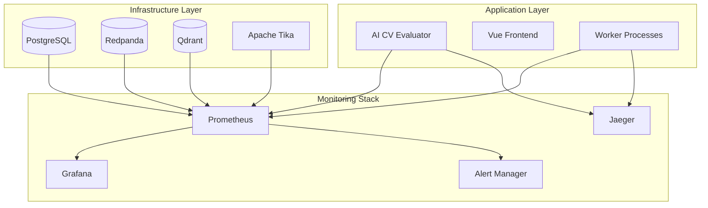

# Performance Guide

This document provides comprehensive guidance on monitoring, analyzing, and optimizing the performance of the AI CV Evaluator system.

## Overview

The performance system tracks key metrics across all system components, providing insights into system health, bottlenecks, and optimization opportunities.

## Performance Metrics

### Key Performance Indicators (KPIs)

| Metric | Target | Measurement |
|--------|--------|-------------|
| **Response Time** | < 100ms | API endpoint latency |
| **Throughput** | > 100 req/s | Requests per second |
| **Job Processing** | < 30s | Average job completion time |
| **Queue Latency** | < 1s | Message processing delay |
| **Database Query** | < 10ms | Average query time |
| **Memory Usage** | < 80% | System memory utilization |
| **CPU Usage** | < 70% | System CPU utilization |

## Monitoring Architecture



## Application Metrics

### Core Application Metrics
- **Request Rate**: HTTP requests per second
- **Response Time**: API endpoint latency
- **Error Rate**: Failed requests percentage
- **Active Jobs**: Number of processing jobs
- **Queue Depth**: Pending messages in queue

### Database Metrics
- **Connection Pool**: Active/idle connections
- **Query Performance**: Average query time
- **Transaction Rate**: Database transactions per second
- **Lock Contention**: Database lock wait time

### Queue Metrics
- **Message Rate**: Messages per second
- **Consumer Lag**: Processing delay
- **Partition Health**: Topic partition status
- **Offset Commits**: Consumer group progress

## Performance Optimization

### Application Optimization
1. **Connection Pooling**: Optimize database connections
2. **Caching**: Implement Redis caching for frequent queries
3. **Async Processing**: Use worker pools for heavy operations
4. **Memory Management**: Monitor and optimize memory usage

### Database Optimization
1. **Indexing**: Add indexes for frequently queried columns
2. **Query Optimization**: Analyze and optimize slow queries
3. **Connection Tuning**: Optimize connection pool settings
4. **Partitioning**: Consider table partitioning for large datasets

### Queue Optimization
1. **Batch Processing**: Process messages in batches
2. **Consumer Scaling**: Scale consumers based on load
3. **Topic Partitioning**: Distribute load across partitions
4. **Retry Logic**: Implement exponential backoff

## Monitoring Tools

### Prometheus Queries
```bash
# Application metrics
curl http://localhost:8080/metrics

# Prometheus metrics
curl http://localhost:9090/api/v1/query?query=up

# Grafana dashboards
open http://localhost:3000
```

### Performance Testing
```bash
# Load testing
go test -tags=load -v ./test/load/...

# Benchmark testing
go test -bench=. ./internal/...

# Memory profiling
go test -memprofile=mem.prof ./internal/...
```

## Alerting

### Critical Alerts
- **High Error Rate**: > 5% error rate
- **High Response Time**: > 1s average response time
- **Queue Backlog**: > 1000 pending messages
- **Database Issues**: Connection failures or slow queries

### Warning Alerts
- **Memory Usage**: > 80% memory utilization
- **CPU Usage**: > 70% CPU utilization
- **Disk Space**: > 85% disk utilization
- **Consumer Lag**: > 30s processing delay

## Troubleshooting

### Common Issues
1. **Slow Response Times**: Check database queries and connection pool
2. **High Memory Usage**: Monitor for memory leaks and optimize caching
3. **Queue Backlog**: Scale consumers or optimize processing
4. **Database Locks**: Check for long-running transactions

### Performance Analysis
1. **Profile CPU**: Use `go tool pprof` for CPU profiling
2. **Profile Memory**: Use `go tool pprof` for memory profiling
3. **Trace Requests**: Use Jaeger for distributed tracing
4. **Monitor Metrics**: Use Grafana for real-time monitoring
