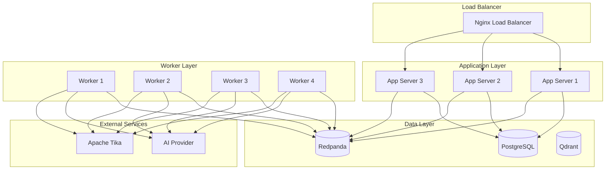

# Scaling Guide

This document provides comprehensive guidance on scaling the AI CV Evaluator system to handle increased load and ensure optimal performance.

## Overview

The scaling strategy covers horizontal and vertical scaling approaches for all system components, including application servers, databases, queues, and AI processing.

## Scaling Architecture

### 1. Current Architecture



### 2. Scaling Dimensions

#### 2.1 Horizontal Scaling
- **Application Servers**: Multiple app instances
- **Workers**: Multiple worker processes
- **Database**: Read replicas
- **Queue**: Multiple partitions

#### 2.2 Vertical Scaling
- **CPU**: Increase processing power
- **Memory**: Increase available RAM
- **Storage**: Increase disk capacity
- **Network**: Increase bandwidth

## Application Scaling

### 1. Horizontal Application Scaling

#### 1.1 Load Balancer Configuration
```nginx
# nginx.conf
upstream app_servers {
    least_conn;
    server app1:8080 max_fails=3 fail_timeout=30s;
    server app2:8080 max_fails=3 fail_timeout=30s;
    server app3:8080 max_fails=3 fail_timeout=30s;
}

server {
    listen 80;
    server_name api.example.com;
    
    location / {
        proxy_pass http://app_servers;
        proxy_set_header Host $host;
        proxy_set_header X-Real-IP $remote_addr;
        proxy_set_header X-Forwarded-For $proxy_add_x_forwarded_for;
        proxy_set_header X-Forwarded-Proto $scheme;
        
        # Health check
        proxy_next_upstream error timeout invalid_header http_500 http_502 http_503 http_504;
    }
}
```

#### 1.2 Docker Compose Scaling
```yaml
# docker-compose.scale.yml
version: '3.8'

services:
  app:
    build: .
    ports:
      - "8080-8082:8080"
    environment:
      - DB_HOST=db
      - KAFKA_BROKERS=redpanda:9092
    deploy:
      replicas: 3
    healthcheck:
      test: ["CMD", "curl", "-f", "http://localhost:8080/healthz"]
      interval: 30s
      timeout: 10s
      retries: 3
```

#### 1.3 Kubernetes Scaling
```yaml
# k8s-deployment.yml
apiVersion: apps/v1
kind: Deployment
metadata:
  name: ai-cv-evaluator-app
spec:
  replicas: 3
  selector:
    matchLabels:
      app: ai-cv-evaluator-app
  template:
    metadata:
      labels:
        app: ai-cv-evaluator-app
    spec:
      containers:
      - name: app
        image: ai-cv-evaluator:latest
        ports:
        - containerPort: 8080
        resources:
          requests:
            memory: "512Mi"
            cpu: "500m"
          limits:
            memory: "1Gi"
            cpu: "1000m"
        livenessProbe:
          httpGet:
            path: /healthz
            port: 8080
          initialDelaySeconds: 30
          periodSeconds: 10
        readinessProbe:
          httpGet:
            path: /readyz
            port: 8080
          initialDelaySeconds: 5
          periodSeconds: 5
---
apiVersion: v1
kind: Service
metadata:
  name: ai-cv-evaluator-service
spec:
  selector:
    app: ai-cv-evaluator-app
  ports:
  - port: 80
    targetPort: 8080
  type: LoadBalancer
```

### 2. Vertical Application Scaling

#### 2.1 Resource Optimization
```yaml
# docker-compose.optimized.yml
services:
  app:
    build: .
    environment:
      - GOMAXPROCS=4
      - GOGC=100
    deploy:
      resources:
        limits:
          memory: 2G
          cpus: '2.0'
        reservations:
          memory: 1G
          cpus: '1.0'
```

#### 2.2 Application Configuration
```go
// Application configuration for scaling
type Config struct {
    Server struct {
        Port         int           `yaml:"port"`
        ReadTimeout  time.Duration `yaml:"read_timeout"`
        WriteTimeout time.Duration `yaml:"write_timeout"`
        IdleTimeout  time.Duration `yaml:"idle_timeout"`
    } `yaml:"server"`
    
    Database struct {
        MaxOpenConns    int           `yaml:"max_open_conns"`
        MaxIdleConns    int           `yaml:"max_idle_conns"`
        ConnMaxLifetime time.Duration `yaml:"conn_max_lifetime"`
    } `yaml:"database"`
    
    Queue struct {
        Workers        int           `yaml:"workers"`
        BatchSize      int           `yaml:"batch_size"`
        FlushInterval  time.Duration `yaml:"flush_interval"`
    } `yaml:"queue"`
}
```

## Database Scaling

### 1. Horizontal Database Scaling

#### 1.1 Read Replicas
```yaml
# docker-compose.db-scale.yml
version: '3.8'

services:
  db-primary:
    image: postgres:15
    environment:
      POSTGRES_DB: app
      POSTGRES_USER: postgres
      POSTGRES_PASSWORD: password
    volumes:
      - db_primary_data:/var/lib/postgresql/data
    command: >
      postgres
      -c max_connections=200
      -c shared_buffers=256MB
      -c effective_cache_size=1GB
      -c maintenance_work_mem=64MB
      -c checkpoint_completion_target=0.9
      -c wal_buffers=16MB
      -c default_statistics_target=100

  db-replica:
    image: postgres:15
    environment:
      POSTGRES_DB: app
      POSTGRES_USER: postgres
      POSTGRES_PASSWORD: password
      PGUSER: postgres
    command: >
      postgres
      -c hot_standby=on
      -c max_connections=200
      -c shared_buffers=256MB
    depends_on:
      - db-primary
```

#### 1.2 Connection Pooling
```go
// Database connection pool configuration
func NewDBPool(config *Config) (*pgxpool.Pool, error) {
    poolConfig := &pgxpool.Config{
        ConnConfig: pgx.ConnConfig{
            Host:     config.Database.Host,
            Port:     config.Database.Port,
            Database: config.Database.Name,
            User:     config.Database.User,
            Password: config.Database.Password,
        },
        MaxConns:        config.Database.MaxOpenConns,
        MinConns:        config.Database.MaxIdleConns,
        MaxConnLifetime: config.Database.ConnMaxLifetime,
        MaxConnIdleTime: time.Minute * 30,
    }
    
    return pgxpool.ConnectConfig(context.Background(), poolConfig)
}
```

### 2. Vertical Database Scaling

#### 2.1 Database Optimization
```sql
-- PostgreSQL configuration for scaling
ALTER SYSTEM SET max_connections = 200;
ALTER SYSTEM SET shared_buffers = '256MB';
ALTER SYSTEM SET effective_cache_size = '1GB';
ALTER SYSTEM SET maintenance_work_mem = '64MB';
ALTER SYSTEM SET checkpoint_completion_target = 0.9;
ALTER SYSTEM SET wal_buffers = '16MB';
ALTER SYSTEM SET default_statistics_target = 100;
ALTER SYSTEM SET random_page_cost = 1.1;
ALTER SYSTEM SET effective_io_concurrency = 200;

-- Reload configuration
SELECT pg_reload_conf();
```

#### 2.2 Index Optimization
```sql
-- Create indexes for better performance
CREATE INDEX CONCURRENTLY idx_jobs_status_created 
ON jobs(status, created_at);

CREATE INDEX CONCURRENTLY idx_uploads_type_created 
ON uploads(type, created_at);

CREATE INDEX CONCURRENTLY idx_results_job_id 
ON results(job_id);

-- Analyze tables for query optimization
ANALYZE jobs;
ANALYZE uploads;
ANALYZE results;
```

## Queue Scaling

### 1. Horizontal Queue Scaling

#### 1.1 Redpanda Cluster
```yaml
# docker-compose.queue-scale.yml
version: '3.8'

services:
  redpanda-1:
    image: redpandadata/redpanda:latest
    command:
      - redpanda
      - start
      - --kafka-addr
      - internal://0.0.0.0:9092,external://0.0.0.0:19092
      - --advertise-kafka-addr
      - internal://redpanda-1:9092,external://localhost:19092
      - --pandaproxy-addr
      - internal://0.0.0.0:8082,external://0.0.0.0:18082
      - --advertise-pandaproxy-addr
      - internal://redpanda-1:8082,external://localhost:18082
      - --schema-registry-addr
      - internal://0.0.0.0:8081,external://0.0.0.0:18081
      - --rpc-addr
      - redpanda-1:33145
      - --advertise-rpc-addr
      - redpanda-1:33145
      - --smp
      - '1'
      - --memory
      - '1G'
      - --mode
      - 'dev'
      - --default-log-level=info

  redpanda-2:
    image: redpandadata/redpanda:latest
    command:
      - redpanda
      - start
      - --kafka-addr
      - internal://0.0.0.0:9092,external://0.0.0.0:19093
      - --advertise-kafka-addr
      - internal://redpanda-2:9092,external://localhost:19093
      - --pandaproxy-addr
      - internal://0.0.0.0:8082,external://0.0.0.0:18083
      - --advertise-pandaproxy-addr
      - internal://redpanda-2:8082,external://localhost:18083
      - --schema-registry-addr
      - internal://0.0.0.0:8081,external://0.0.0.0:18084
      - --rpc-addr
      - redpanda-2:33146
      - --advertise-rpc-addr
      - redpanda-2:33146
      - --smp
      - '1'
      - --memory
      - '1G'
      - --mode
      - 'dev'
      - --default-log-level=info

  redpanda-3:
    image: redpandadata/redpanda:latest
    command:
      - redpanda
      - start
      - --kafka-addr
      - internal://0.0.0.0:9092,external://0.0.0.0:19094
      - --advertise-kafka-addr
      - internal://redpanda-3:9092,external://localhost:19094
      - --pandaproxy-addr
      - internal://0.0.0.0:8082,external://0.0.0.0:18085
      - --advertise-pandaproxy-addr
      - internal://redpanda-3:8082,external://localhost:18085
      - --schema-registry-addr
      - internal://0.0.0.0:8081,external://0.0.0.0:18086
      - --rpc-addr
      - redpanda-3:33147
      - --advertise-rpc-addr
      - redpanda-3:33147
      - --smp
      - '1'
      - --memory
      - '1G'
      - --mode
      - 'dev'
      - --default-log-level=info
```

#### 1.2 Topic Partitioning
```bash
# Create topic with multiple partitions
rpk topic create evaluate-jobs --partitions 6 --replicas 3

# Check topic configuration
rpk topic describe evaluate-jobs

# Check partition distribution
rpk topic consume evaluate-jobs --print-headers
```

### 2. Vertical Queue Scaling

#### 2.1 Queue Configuration
```yaml
# Redpanda configuration for scaling
redpanda:
  auto_create_topics_enabled: true
  default_topic_partitions: 3
  topic_memory_per_partition: 1GB
  log_segment_size: 1GB
  log_retention_ms: 604800000  # 7 days
  log_retention_bytes: 1073741824  # 1GB
  log_compression_type: "snappy"
  log_cleanup_policy: "delete"
  log_cleanup_interval_ms: 300000  # 5 minutes
```

## Worker Scaling

### 1. Horizontal Worker Scaling

**Note**: The system now uses a single optimized worker with high internal concurrency instead of multiple worker containers. For horizontal scaling in production, consider scaling the entire application stack rather than individual workers.

#### 1.1 Worker Deployment (Single Optimized Worker)
```yaml
# docker-compose.yml
services:
  worker:
    build: .
    command: ["./worker"]
    environment:
      - DB_HOST=db
      - KAFKA_BROKERS=redpanda:9092
      - CONSUMER_MAX_CONCURRENCY=24  # High internal concurrency
    deploy:
      resources:
        limits:
          memory: 2G
          cpus: '2.0'
        reservations:
          memory: 1G
          cpus: '1.0'
    healthcheck:
      test: ["CMD", "curl", "-f", "http://localhost:8080/healthz"]
      interval: 30s
      timeout: 10s
      retries: 3
```

#### 1.2 Kubernetes Worker Scaling (Single Optimized Worker per Pod)
```yaml
# k8s-worker-deployment.yml
apiVersion: apps/v1
kind: Deployment
metadata:
  name: ai-cv-evaluator-worker
spec:
  replicas: 3  # Scale pods, not workers per pod
  selector:
    matchLabels:
      app: ai-cv-evaluator-worker
  template:
    metadata:
      labels:
        app: ai-cv-evaluator-worker
    spec:
      containers:
      - name: worker
        image: ai-cv-evaluator:latest
        command: ["./worker"]
        resources:
          requests:
            memory: "1Gi"
            cpu: "1000m"
          limits:
            memory: "2Gi"
            cpu: "2000m"
        env:
        - name: DB_HOST
          value: "db"
        - name: KAFKA_BROKERS
          value: "redpanda:9092"
        - name: CONSUMER_MAX_CONCURRENCY
          value: "24"  # High internal concurrency
---
apiVersion: v1
kind: Service
metadata:
  name: ai-cv-evaluator-worker-service
spec:
  selector:
    app: ai-cv-evaluator-worker
  ports:
  - port: 8080
    targetPort: 8080
```

### 2. Vertical Worker Scaling

#### 2.1 Worker Configuration (Internal Concurrency)
```go
// Worker configuration for scaling via internal concurrency
// Controlled by CONSUMER_MAX_CONCURRENCY environment variable
// Default: 24 concurrent goroutines
// 
// The worker automatically scales its internal pool based on:
// - Queue depth
// - Available resources
// - Processing latency
//
// Configuration in docker-compose.yml:
// environment:
//   - CONSUMER_MAX_CONCURRENCY=24  # Adjust based on workload
//
// For higher throughput:
//   - CONSUMER_MAX_CONCURRENCY=32
//   - Increase CPU: cpus: '4.0'
//   - Increase Memory: memory: 4G
```

## Vector Database Scaling

### 1. Qdrant Scaling

#### 1.1 Qdrant Cluster
```yaml
# docker-compose.vector-scale.yml
version: '3.8'

services:
  qdrant-1:
    image: qdrant/qdrant:latest
    ports:
      - "6333:6333"
      - "6334:6334"
    volumes:
      - qdrant_1_data:/qdrant/storage
    environment:
      - QDRANT__SERVICE__HTTP_PORT=6333
      - QDRANT__SERVICE__GRPC_PORT=6334
    command:
      - ./qdrant
      - --config-path
      - /qdrant/config/production.yaml

  qdrant-2:
    image: qdrant/qdrant:latest
    ports:
      - "6335:6333"
      - "6336:6334"
    volumes:
      - qdrant_2_data:/qdrant/storage
    environment:
      - QDRANT__SERVICE__HTTP_PORT=6333
      - QDRANT__SERVICE__GRPC_PORT=6334
    command:
      - ./qdrant
      - --config-path
      - /qdrant/config/production.yaml

  qdrant-3:
    image: qdrant/qdrant:latest
    ports:
      - "6337:6333"
      - "6338:6334"
    volumes:
      - qdrant_3_data:/qdrant/storage
    environment:
      - QDRANT__SERVICE__HTTP_PORT=6333
      - QDRANT__SERVICE__GRPC_PORT=6334
    command:
      - ./qdrant
      - --config-path
      - /qdrant/config/production.yaml
```

#### 1.2 Collection Configuration
```python
# Qdrant collection configuration for scaling
from qdrant_client import QdrantClient
from qdrant_client.models import Distance, VectorParams

client = QdrantClient("localhost", port=6333)

# Create collection with optimized parameters
client.create_collection(
    collection_name="cv_vectors",
    vectors_config=VectorParams(
        size=1536,  # OpenAI embedding size
        distance=Distance.COSINE
    ),
    # Scaling parameters
    shard_number=3,  # Number of shards
    replication_factor=2,  # Replication factor
    write_consistency_factor=1,  # Write consistency
    on_disk_payload=True,  # Store payload on disk
    hnsw_config={
        "m": 16,  # Number of bi-directional links
        "ef_construct": 100,  # Size of dynamic candidate list
        "full_scan_threshold": 10000,  # Full scan threshold
    }
)
```

## Load Testing

### 1. Load Testing Tools

#### 1.1 Apache Bench
```bash
# Basic load test
ab -n 1000 -c 10 http://localhost:8080/healthz

# Extended load test
ab -n 10000 -c 100 -t 60 http://localhost:8080/healthz

# Load test with data
ab -n 1000 -c 10 -p testdata.json -T application/json http://localhost:8080/v1/upload
```

#### 1.2 wrk
```bash
# Basic load test
wrk -t12 -c400 -d30s http://localhost:8080/healthz

# Load test with Lua script
wrk -t12 -c400 -d30s -s upload.lua http://localhost:8080/v1/upload
```

#### 1.3 k6
```javascript
// k6 load test script
import http from 'k6/http';
import { check } from 'k6';

export let options = {
  stages: [
    { duration: '2m', target: 100 },
    { duration: '5m', target: 100 },
    { duration: '2m', target: 200 },
    { duration: '5m', target: 200 },
    { duration: '2m', target: 0 },
  ],
};

export default function() {
  let response = http.get('http://localhost:8080/healthz');
  check(response, {
    'status is 200': (r) => r.status === 200,
    'response time < 500ms': (r) => r.timings.duration < 500,
  });
}
```

### 2. Performance Monitoring

#### 2.1 Prometheus Metrics
```yaml
# prometheus.yml for scaling
global:
  scrape_interval: 15s
  evaluation_interval: 15s

scrape_configs:
  - job_name: 'ai-cv-evaluator'
    static_configs:
      - targets: ['app1:8080', 'app2:8080', 'app3:8080']
    metrics_path: '/metrics'
    scrape_interval: 5s

  - job_name: 'workers'
    static_configs:
      - targets: ['worker1:8080', 'worker2:8080', 'worker3:8080', 'worker4:8080']
    metrics_path: '/metrics'
    scrape_interval: 5s

  - job_name: 'database'
    static_configs:
      - targets: ['postgres-exporter:9187']
    scrape_interval: 15s

  - job_name: 'queue'
    static_configs:
      - targets: ['redpanda:9644']
    metrics_path: '/metrics'
    scrape_interval: 15s
```

#### 2.2 Grafana Dashboards
```json
{
  "dashboard": {
    "title": "Scaling Dashboard",
    "panels": [
      {
        "title": "Request Rate",
        "type": "graph",
        "targets": [
          {
            "expr": "rate(http_requests_total[5m])",
            "legendFormat": "{{instance}}"
          }
        ]
      },
      {
        "title": "Response Time",
        "type": "graph",
        "targets": [
          {
            "expr": "histogram_quantile(0.95, rate(http_request_duration_seconds_bucket[5m]))",
            "legendFormat": "95th percentile"
          }
        ]
      },
      {
        "title": "Worker Utilization",
        "type": "graph",
        "targets": [
          {
            "expr": "workers_active_total",
            "legendFormat": "Active Workers"
          },
          {
            "expr": "workers_idle_total",
            "legendFormat": "Idle Workers"
          }
        ]
      },
      {
        "title": "Queue Lag",
        "type": "graph",
        "targets": [
          {
            "expr": "queue_lag_seconds",
            "legendFormat": "{{topic}} - {{partition}}"
          }
        ]
      }
    ]
  }
}
```

## Auto-Scaling

### 1. Horizontal Pod Autoscaler (HPA)

#### 1.1 Kubernetes HPA
```yaml
# k8s-hpa.yml
apiVersion: autoscaling/v2
kind: HorizontalPodAutoscaler
metadata:
  name: ai-cv-evaluator-hpa
spec:
  scaleTargetRef:
    apiVersion: apps/v1
    kind: Deployment
    name: ai-cv-evaluator-app
  minReplicas: 3
  maxReplicas: 10
  metrics:
  - type: Resource
    resource:
      name: cpu
      target:
        type: Utilization
        averageUtilization: 70
  - type: Resource
    resource:
      name: memory
      target:
        type: Utilization
        averageUtilization: 80
  behavior:
    scaleUp:
      stabilizationWindowSeconds: 60
      policies:
      - type: Percent
        value: 100
        periodSeconds: 15
    scaleDown:
      stabilizationWindowSeconds: 300
      policies:
      - type: Percent
        value: 10
        periodSeconds: 60
```

#### 1.2 Custom Metrics HPA
```yaml
# k8s-custom-hpa.yml
apiVersion: autoscaling/v2
kind: HorizontalPodAutoscaler
metadata:
  name: ai-cv-evaluator-custom-hpa
spec:
  scaleTargetRef:
    apiVersion: apps/v1
    kind: Deployment
    name: ai-cv-evaluator-app
  minReplicas: 3
  maxReplicas: 20
  metrics:
  - type: Pods
    pods:
      metric:
        name: queue_lag_seconds
      target:
        type: AverageValue
        averageValue: "10"
  - type: Pods
    pods:
      metric:
        name: http_requests_per_second
      target:
        type: AverageValue
        averageValue: "100"
```

### 2. Vertical Pod Autoscaler (VPA)

#### 2.1 VPA Configuration
```yaml
# k8s-vpa.yml
apiVersion: autoscaling.k8s.io/v1
kind: VerticalPodAutoscaler
metadata:
  name: ai-cv-evaluator-vpa
spec:
  targetRef:
    apiVersion: apps/v1
    kind: Deployment
    name: ai-cv-evaluator-app
  updatePolicy:
    updateMode: "Auto"
  resourcePolicy:
    containerPolicies:
    - containerName: app
      minAllowed:
        cpu: 100m
        memory: 128Mi
      maxAllowed:
        cpu: 2
        memory: 4Gi
      controlledResources: ["cpu", "memory"]
```

## Scaling Best Practices

### 1. Performance Optimization

#### 1.1 Application Optimization
- **Connection Pooling**: Optimize database connection pools
- **Caching**: Implement Redis for session and data caching
- **Compression**: Enable gzip compression for responses
- **CDN**: Use CDN for static assets

#### 1.2 Database Optimization
- **Indexing**: Create appropriate indexes
- **Query Optimization**: Optimize slow queries
- **Partitioning**: Partition large tables
- **Archiving**: Archive old data

#### 1.3 Queue Optimization
- **Partitioning**: Use multiple partitions for parallel processing
- **Batching**: Process messages in batches
- **Compression**: Enable message compression
- **Retention**: Set appropriate retention policies

### 2. Monitoring and Alerting

#### 2.1 Key Metrics
- **Request Rate**: Requests per second
- **Response Time**: 95th percentile response time
- **Error Rate**: Error percentage
- **Resource Usage**: CPU, memory, disk usage
- **Queue Metrics**: Lag, throughput, processing time

#### 2.2 Alerting Rules
```yaml
# alerting-rules.yml
groups:
  - name: scaling
    rules:
      - alert: HighCPUUsage
        expr: rate(container_cpu_usage_seconds_total[5m]) > 0.8
        for: 2m
        labels:
          severity: warning
        annotations:
          summary: "High CPU usage detected"
          description: "CPU usage is {{ $value }}%"

      - alert: HighMemoryUsage
        expr: container_memory_usage_bytes / container_spec_memory_limit_bytes > 0.9
        for: 2m
        labels:
          severity: warning
        annotations:
          summary: "High memory usage detected"
          description: "Memory usage is {{ $value }}%"

      - alert: HighQueueLag
        expr: queue_lag_seconds > 300
        for: 2m
        labels:
          severity: critical
        annotations:
          summary: "High queue lag detected"
          description: "Queue lag is {{ $value }} seconds"
```

### 3. Capacity Planning

#### 3.1 Growth Projections
- **User Growth**: Project user growth over time
- **Data Growth**: Estimate data storage requirements
- **Traffic Growth**: Predict traffic patterns
- **Resource Growth**: Plan resource requirements

#### 3.2 Scaling Triggers
- **CPU Usage**: Scale when CPU > 70%
- **Memory Usage**: Scale when memory > 80%
- **Queue Lag**: Scale when lag > 5 minutes
- **Response Time**: Scale when response time > 2 seconds

## Troubleshooting Scaling Issues

### 1. Common Scaling Problems

#### 1.1 Resource Exhaustion
```bash
# Check resource usage
docker stats --no-stream

# Check system resources
htop
free -h
df -h

# Check network usage
iftop
nethogs
```

#### 1.2 Database Bottlenecks
```sql
-- Check slow queries
SELECT query, calls, total_time, mean_time 
FROM pg_stat_statements 
ORDER BY mean_time DESC 
LIMIT 10;

-- Check database locks
SELECT * FROM pg_locks WHERE NOT granted;

-- Check connection usage
SELECT count(*) FROM pg_stat_activity;
```

#### 1.3 Queue Issues
```bash
# Check queue lag
rpk group describe ai-cv-evaluator-workers

# Check topic status
rpk topic describe evaluate-jobs

# Check consumer group
rpk group list
```

### 2. Performance Tuning

#### 2.1 Application Tuning
```go
// Application performance tuning
func optimizeApplication() {
    // Set GOMAXPROCS
    runtime.GOMAXPROCS(runtime.NumCPU())
    
    // Optimize GC
    debug.SetGCPercent(100)
    
    // Connection pooling
    config := &pgxpool.Config{
        MaxConns:        20,
        MinConns:        5,
        MaxConnLifetime: time.Hour,
        MaxConnIdleTime: time.Minute * 30,
    }
}
```

#### 2.2 Database Tuning
```sql
-- PostgreSQL performance tuning
ALTER SYSTEM SET shared_buffers = '256MB';
ALTER SYSTEM SET effective_cache_size = '1GB';
ALTER SYSTEM SET maintenance_work_mem = '64MB';
ALTER SYSTEM SET checkpoint_completion_target = 0.9;
ALTER SYSTEM SET wal_buffers = '16MB';
ALTER SYSTEM SET default_statistics_target = 100;
```

---

*This scaling guide ensures the AI CV Evaluator system can handle increased load while maintaining performance and reliability.*
